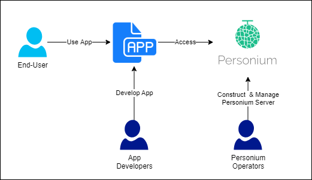

All Personium-related documentation are available on this page.  
If you have any questions, please contact [Slack Community](https://personium-io.slack.com/).  
Register to join the Slack community [here](https://bit.ly/Join_Personium_Slack).  

## Introduction

* [What is Personium?](./introduction/001_introduction.md)
* [Personium Architecture](./introduction/001_Personium_Architecture.md)
* [Glossary](./user_guide/008_Glossary.md)

## Personium user types

Personium users can be divided into the following:

| User type | Description |
|-------------|----|
|Personium operator |Constructs Personium server and manages PDS services|
| App Developer | Developes apps using Personium APIs |

The figure below shows the relationship.

## Getting Started

Below you will find the introductory documentation for Personium operators and app developers.

[Getting Started](./getting-started/README.md)

## User Guides

We provide a guide for each type of Personium user and a contributor guide for Personium project participants.

### Personium Operators

Personium operators are further divided into server software operators and unit administrators.

#### [Server Software Operator's Guide](./server-operator/README.md)

It is a document for people who want to provide / operate PDS service environment using Personium

#### [Unit Administrator's Guide](./unit-administrator/README.md)

It is a document for people who want to manage pre-built Personium units and those who want users to use PDS applications to provide PDS service using Personium

### For App Developers

#### [App Developer's Guide](./app-developer/README.md)

Documents for people who want to develop PDS applications using Personium's API

## Contributor Guides

### For Document Contribution

#### [Documentation Contributor's Guide](./document-writer/README.md)

The contributor guide is for participants who want to maintain and improve the documentation of the Personium project.

### For Code Contribution

#### [Server Developer's Guide](./software-developer/README.md)

It is a document for people who want to develop Personium's OSS function or who want to commit to OSS
