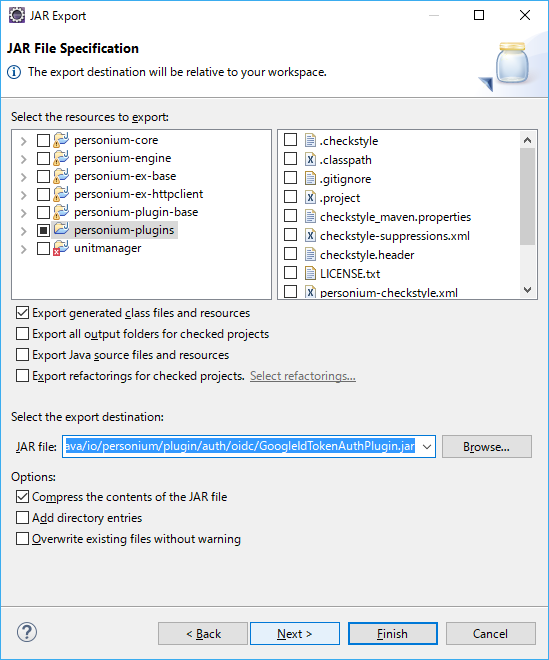

Personium Authentication Plugin Developer Manual
======

This is a document of  **Personium** Authentication Plugin Developer Manual.

Documents
------

It describes the information necessary for developing Personium's Authentication plugin.
This document explains the procedure for creating Authentication plugin.

## What is an Authentication Plugin?

The Personium Authentication Plugin is intended to extend the behavior of OAuth 2 token End Point of Cell.
By introducing an Authentication Plugin into the unit, the expanded behavior defined for the plugin is added to the OAuth 2 token end point of all Cells on that unit.
In OAuth 2, the token endpoint is responsible for issuing an access token for resource access.
With the OAuth 2.0 specification, grant_type which is a required parameter of this end point can be used by defining arbitrary absolute URI in addition to the following values which are definition values in the specification.

- ・authorization_code  (Not supported）
- ・password
- ・refresh_token
- ・client_credentials  (Not supported）

reference: https://tools.ietf.org/html/rfc6749#section-4.5

The Personium Authentication Plugin describes it in a corresponding form.

## Method of development

Specifically, the plugin defines the following two points.

* 1.What kind of grant_type value should be handled
* 2.How to evaluate the input parameter values other than grant_type of the token endpoint and what kind of entity should be recognized as a result

In other words, the plugin author implements the above two pieces of information as concrete Java code.
Personium further evaluates the authenticated identification subject information (AuthenticatedIdentity object) returned by the Authentication Plugin as the response 2 above from the following point of view,
We decide whether or not to issue a token, determine the content of issue token, and issue token.

- ・Is there an Account with a Name attribute in the string that can be obtained with getAccountName ()
- ・If it exists, the type value of the hit Account contains the character string of urn: of the grant_type parameter

## Security considerations

Naturally, the plug-in author should generally implement the "parameter value evaluation" above in 2 so that the access agent goes through the appropriate authentication process.
For example, a specific subject (such as a real person who is not a guest etc.) to be originally protected without checking any input value,
Creating such a plug-in as to recognize it and placing it in the unit causes serious security problems.
Therefore, it is necessary for the plug-in author to implement a secure implementation, and the plug-in user (unit administrator) to use only plug-ins that are believed to be secure.

---

The following is an example using the google version Authentication Plugin.

## Class structure of Plugin

The border part of the creation plug-in is created.

The class structure diagram of Authentication Plugin is shown below.


> **Note:**  Return value of authentication processing
> - If authentication succeeds, AuthenticatedIdentity is returned.
> - If authentication fails, a PersoniumCoreAuthnException is thrown.

## Plugin Behavior

The operation of Authentication Plugin is shown below.


　1. Plugin initialization processing
　   PluginManager is called in the PersoniumCoreApplication class and reads all plugins.

　2. Call authentication process
　   In the TokenEndPointResouce class, select the target GrantType Plugin.
　   Execute the authenticate method of the selected plugin.

> **Note:**
> - Personium Plugin can be executed simply by placing it in the Plugins folder.
> - The Authenticate Plugin specifies each provider for "Auth" and GrantType as Type, and by writing the authenticate method, the target plugin is selected and the authenticate method is executed.

### 1.Plugin initialization processing
####<i class="icon-file"></i>PersoniumCoreApplication.java
```
public class PersoniumCoreApplication extends Application {
    private static PluginManager pm;

    static {
        try {
            TransCellAccessToken.configureX509(PersoniumUnitConfig.getX509PrivateKey(),
                    PersoniumUnitConfig.getX509Certificate(), PersoniumUnitConfig.getX509RootCertificate());
            LocalToken.setKeyString(PersoniumUnitConfig.getTokenSecretKey());
            DataCryptor.setKeyString(PersoniumUnitConfig.getTokenSecretKey());
            pm = new PluginManager();
        } catch (Exception e) {
            PersoniumCoreLog.Server.FAILED_TO_START_SERVER.reason(e).writeLog();
            throw new RuntimeException(e);
        }
    }
```
　pm = new PluginManager();
　Generate the PluginManager class.

---
### 2.Call authentication process
####<i class="icon-file"></i>TokenEndPointResource.java
```
            PluginInfo pi = pm.getPluginsByGrantType(grantType);        // Search target plug-in.
            PluginManager pm = PersoniumCoreApplication.getPluginManager();    // Plugin manager.
            if (pi == null) {                                           // Plug-ins do not exist.
                throw PersoniumCoreAuthnException.UNSUPPORTED_GRANT_TYPE.realm(this.cell.getUrl());
            }
            AuthenticatedIdentity ai = null;
            // Invoke the plug-in function.
            Map<String, String> body = new HashMap<String, String>();
            body.put(AuthConst.KEY_TOKEN, idToken);
            Object plugin = (Plugin) pi.getObj();
            try {
                ai = ((AuthPlugin) plugin).authenticate(body);
            } catch (PersoniumCoreAuthnException e) {
                PersoniumCoreAuthnException pcae = PersoniumCoreAuthnException.mapFrom(pe);
                if (pcae != null) {
                    throw pcae;
                }
                throw PersoniumCoreAuthnException.Plugin.PLUGIN_DEFINED_CLIENT_ERROR.reason(pe);

            } catch (Exception e) {
                // Unexpected exception throwed from "Plugin", create default PersoniumCoreAuthException
                // and set reason from catched Exception.
                throw PersoniumCoreException.Plugin.UNEXPECTED_ERROR.reason(e);
            }
```
---
## Procedure for creating plugin

Follow the steps below to create a plugin.

　1. Create Java Source Program
　2. Create manifest File
　3. Export jar File
　4. Setting jar File
　5. Test & debug the Plugin

---
###  1. Create Java Source Program

Copy GoogleIdTokenAuthPlugin.java and replace all parts marked **google** with the name of the Authentication plugin you will create.

---
####<i class="icon-file"></i> **GoogleIdTokenAuthPlugin.java**
```
/**
 * personium.io
 * Copyright 2017 FUJITSU LIMITED
 *
 * Licensed under the Apache License, Version 2.0 (the "License");
 * you may not use this file except in compliance with the License.
 * You may obtain a copy of the License at
 *
 *     http://www.apache.org/licenses/LICENSE-2.0
 *
 * Unless required by applicable law or agreed to in writing, software
 * distributed under the License is distributed on an "AS IS" BASIS,
 * WITHOUT WARRANTIES OR CONDITIONS OF ANY KIND, either express or implied.
 * See the License for the specific language governing permissions and
 * limitations under the License.
 */
package io.personium.plugin.auth.oidc;

import java.util.Map;

import io.personium.plugin.base.PluginConfig.OIDC;
import io.personium.plugin.base.PluginLog;
import io.personium.plugin.base.PluginException;
import io.personium.plugin.base.auth.AuthPlugin;
import io.personium.plugin.base.auth.AuthConst;
import io.personium.plugin.base.auth.AuthenticatedIdentity;

public class GoogleIdTokenAuthPlugin implements AuthPlugin {
    /** to String. **/
    public static final String PLUGIN_TOSTRING = "Google Open ID Connect Authentication";

    /** urn google grantType. **/
    public static final String PLUGIN_GRANT_TYPE = "urn:x-personium:oidc:google";

    /**
     * toString.
     * @return String
     */
    public String toString(){
        return PLUGIN_TOSTRING;
    }

    /**
     * getType.
     * @return String
     */
    public String getType() {
        return AuthConst.TYPE_AUTH;
    }

    /**
     * getGrantType.
     * @return String
     */
    public String getGrantType() {
        return PLUGIN_GRANT_TYPE;
    }

    /**
     * Google URL
     */
    public static final String URL_HTTPS = "https://";
    public static final String URL_ISSUER = "accounts.google.com";

    /**
     * Type値 oidc:google.
     */
    public static final String OIDC_PROVIDER = "google";

    /**
     * authenticate.
     * @return au AuthenticatedIdentity
     * @throws PluginException
     */
    public AuthenticatedIdentity authenticate(Map <String, String> body) throws PluginException {
        AuthenticatedIdentity ai = null;
        if (body == null) {
            throw PluginException.Authn.REQUIRED_PARAM_MISSING.params("Body");
        }

        // verify idToken
        String idToken = (String)body.get(AuthConst.KEY_TOKEN);
        if (idToken == null) {
            throw PluginException.Authn.REQUIRED_PARAM_MISSING.params("ID Token");
        }

        GoogleIdToken ret = null;
        try {
            // id_tokenをパースする
            ret = GoogleIdToken.parse(idToken);
        } catch(PluginException pe){
            throw PluginException.Authn.OIDC_INVALID_ID_TOKEN;
        }

        // Tokenの検証   検証失敗時にはPluginExceptionが投げられる
        ret.verify();

        String issuer = ret.getIssuer();
        String aud  = ret.getAudience();
        String mail = ret.getEmail();

        // Token検証成功の後処理
        // Googleが認めたissuerであるかどうか
        if (!issuer.equals(URL_ISSUER) && !issuer.equals(URL_HTTPS + URL_ISSUER)) {
            PluginLog.OIDC.INVALID_ISSUER.params(issuer).writeLog();
            throw PluginException.Authn.OIDC_AUTHN_FAILED;
        }

        // Googleに登録したサービス/アプリのClientIDかを確認
        // DcConfigPropatiesに登録したClientIdに一致していればOK
        if (!OIDC.isProviderClientIdTrusted(OIDC_PROVIDER, aud)) {
            throw PluginException.Authn.OIDC_WRONG_AUDIENCE.params(aud);
        }

        // 正常な場合、AuthenticatedIdentity を返却する。
        ai = new AuthenticatedIdentity();
        // アカウント名を設定する
        ai.setAccountName(mail);
        // OIDC TYPEを設定する
        ai.setAttributes(AuthConst.KEY_OIDC_TYPE, AuthConst.KEY_OIDC_TYPE + ":" + OIDC_PROVIDER);

        return ai;
    }
}
```
If Authentication is normal, it returns AuthenticatedIdentity.

---
### 2. Create Manifest File

To generate the **jar file**, create a manifest.txt file.
#### <i class="icon-file"></i>**manifest.txt**
```
Manifest-Version: 1.0
Plugin-Class: io.personium.plugin.auth.google.code.GoogleIdTokenAuthPlugin
```
Write the information to create the jar file.
Plugin - Class is the format of package + class name.

---
### 3. Export jar File

####<i class="icon-file"></i>GoogleIdTokenAuthPlugin.jar

Create a jar file using Eclipse.

1) Select the created plug-in and click "Export ..." in the menu displayed by right-clicking.


2) Select "Java - JAR file" and click "Next>".


3) Specify the path and name of the Jar file you want to create and click "Next>".


4) Click "Next>".


5) Specify the manifest file and click "Finish".

A Jar file is created in the specified path.

---
### 4. Setting jar File
####<i class="icon-hdd"></i>personium-unit-config.properties
```
# general configurations
io.personium.core.plugin.path=/personium/personium-core/plugins
```
Place the created jar file in the path of the plugins folder set in the personium-unit-config.properties file.

---
### 5. Test & debug the Plugin

#### <i class="icon-file"></i>**PluginTest.java**
io.personium.test.plugin

The final step is testing and debugging.
To test this plugin with junit, add a test processing method to PluginTest.java.
Execute the created junit and confirm that the operation ends normally.

---

  [1]: http://personium.io/
  [2]: http://personium.io/docs/
  [3]: https://github.com/personium/
  [4]: http://openid.net/
  [5]: https://oauth.net/
