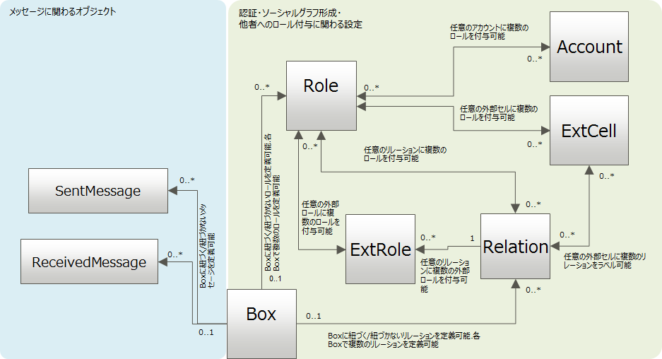

#### メッセージのモデル

#### イベントのモデル

#### [認証モデル](./003_Auth.html)

#### [アクセス制御モデル](../apiref/current/006_Access_Control.md)

### Boxインストール
* barファイルを使って指定されたパスにBoxをインストールすることが可能です。
* 詳細は[こちら](../apiref/current/007_Box_install.md)をご覧下さい。

### Cell制御オブジェクト

### Account
準備中

### Role
* 発行
* 管理
* Roleクラス・Roleインスタンス
* Roleリソース

準備中

### Relation
準備中

### ExtCell
準備中

### ExtRole
準備中

#### $links設定

### Box
準備中

### SentMessage
準備中

### ReceivedMessage
準備中

### Rule
準備中

### Collection
* Collectionは、Boxの中に格納されたデータ集合です。
* 以下の4種類が存在します。

	* [WebDAVモデル](./007_WebDAV_model.md)
	* ODataモデル
	* サービスのモデル
	* Streamモデル
